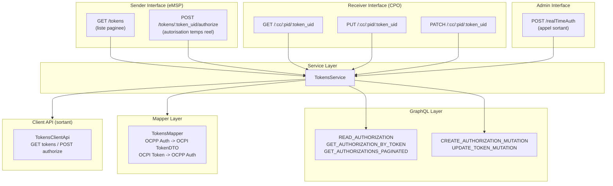

<!-- SPDX-FileCopyrightText: 2025 Contributors to the CitrineOS Project -->
<!--                                                                       -->
<!-- SPDX-License-Identifier: Apache-2.0 -->

# Module Tokens OCPI 2.2.1 - Documentation technique

## Vue d'ensemble

Le module Tokens implemente la specification OCPI 2.2.1 pour la gestion des tokens d'identification (cartes RFID, identifiants d'applications, etc.). Il couvre les deux interfaces definies par la norme :

- **Sender Interface (eMSP)** : expose la liste des tokens aux partenaires via un endpoint pagine et permet l'autorisation temps reel
- **Receiver Interface (CPO)** : recoit, consulte et met a jour les tokens pousses par un eMSP

Le module prend egalement en charge le **Real-time Authorization Flow** qui permet a un CPO de demander une autorisation en temps reel a un eMSP pour un token donne.

---

## Architecture



---

## Endpoints API

### Sender Interface (eMSP)

| Methode | Route                                     | Description                                                                                                                                   |
| ------- | ----------------------------------------- | --------------------------------------------------------------------------------------------------------------------------------------------- |
| `GET`   | `/:versionId/tokens`                      | Liste paginee de tous les tokens. Supporte `date_from`, `date_to`, `offset`, `limit`.                                                         |
| `POST`  | `/:versionId/tokens/:token_uid/authorize` | Autorisation temps reel. Le CPO demande a l'eMSP si le token est autorise. Body optionnel : `LocationReferences`. Query optionnel : `?type=`. |

### Receiver Interface (CPO)

| Methode | Route                                                   | Description                                                                                                                       |
| ------- | ------------------------------------------------------- | --------------------------------------------------------------------------------------------------------------------------------- |
| `GET`   | `/:versionId/tokens/:country_code/:party_id/:token_uid` | Recupere un token specifique par ses identifiants OCPI. Query optionnel : `?type=`. Retourne `404` si non trouve.                 |
| `PUT`   | `/:versionId/tokens/:country_code/:party_id/:token_uid` | Cree ou met a jour un token. Le body est valide par `TokenDTOSchema`. Le `token_uid` de l'URL doit correspondre au `uid` du body. |
| `PATCH` | `/:versionId/tokens/:country_code/:party_id/:token_uid` | Mise a jour partielle d'un token. Le champ `last_updated` est obligatoire dans le body.                                           |

### Admin Interface

| Methode | Route                             | Description                                                                                                   |
| ------- | --------------------------------- | ------------------------------------------------------------------------------------------------------------- |
| `POST`  | `/:versionId/tokens/realTimeAuth` | Endpoint interne (OIDC si configure). Declenche un appel sortant d'autorisation temps reel via le client API. |

---

## Fichiers et responsabilites

### Controller

**`03_Modules/Tokens/src/module/TokensModuleApi.ts`**

Controleur principal enregistre sur `/:versionId/tokens`. Implemente `ITokensModuleApi`. Methodes :

- `getTokensPaginated()` -- Sender GET pagine avec `@Paginated()`, `@FunctionalEndpointParams()`
- `getTokens()` -- Receiver GET unitaire, lance `UnknownTokenException` si absent
- `putToken()` -- Receiver PUT, valide le body avec `@BodyWithExample(TokenDTOSchema)`, delegue a `TokensService.upsertToken()`
- `patchToken()` -- Receiver PATCH, valide la presence de `last_updated`, delegue a `TokensService.patchToken()`
- `postAuthorize()` -- Sender POST authorize, accepte un body optionnel `LocationReferences`, delegue a `TokensService.authorizeToken()`
- `realTimeAuthorization()` -- Admin POST, delegue a `TokensService.realTimeAuthorization()` (appel sortant)

### Interface

**`03_Modules/Tokens/src/module/ITokensModuleApi.ts`**

Contrat TypeScript definissant les signatures de `getTokensPaginated`, `getTokens`, `putToken`, `patchToken` et `postAuthorize`.

### Service

**`00_Base/src/services/TokensService.ts`**

Couche metier injectee via `typedi`. Methodes :

| Methode                                                          | Description                                                                                                                                                                                               |
| ---------------------------------------------------------------- | --------------------------------------------------------------------------------------------------------------------------------------------------------------------------------------------------------- |
| `getToken(tokenRequest)`                                         | Lookup par uid + type + country_code/party_id via `READ_AUTHORIZATION`. Retourne le token mappe ou `undefined`.                                                                                           |
| `upsertToken(token, tenantId, tenantPartnerId)`                  | Cree ou met a jour un token. Gere le `group_id` via `handleGroupAuthorization`. Utilise `CREATE_AUTHORIZATION_MUTATION` ou `UPDATE_TOKEN_MUTATION`.                                                       |
| `patchToken(tokenUid, type, token, tenantId, tenantPartnerId)`   | Mise a jour partielle. Fusionne les `additionalInfo`. Verifie l'existence du token, lance `UnknownTokenException` si absent.                                                                              |
| `getTokensPaginated(ocpiHeaders, paginatedParams?)`              | Liste paginee via `GET_AUTHORIZATIONS_PAGINATED`. Filtre par tenant partner et dates optionnelles.                                                                                                        |
| `authorizeToken(tokenUid, type, tenantPartnerId, locationRefs?)` | Autorisation entrante : recherche le token, determine le statut (`ALLOWED`, `BLOCKED`, `EXPIRED`, etc.), retourne `AuthorizationInfo`. Lance `UnknownTokenException` si le token est inconnu (OCPI 2004). |
| `realTimeAuthorization(realTimeAuthRequest)`                     | Appel sortant : resout le tenant partner, construit les `LocationReferences` si applicable, appelle `TokensClientApi.postToken()` vers le partenaire.                                                     |

### Mapper

**`00_Base/src/mapper/TokensMapper.ts`**

Classe statique de conversion bidirectionnelle :

| Methode                                    | Direction                  | Description                                                                                                                            |
| ------------------------------------------ | -------------------------- | -------------------------------------------------------------------------------------------------------------------------------------- |
| `toDto(authorization)`                     | OCPP Auth -> OCPI TokenDTO | Convertit une `AuthorizationDto` interne en `TokenDTO` OCPI. Extrait `contract_id`, `visual_number`, `issuer` depuis `additionalInfo`. |
| `mapOcpiTokenTypeToOcppIdTokenType(type)`  | OCPI -> OCPP               | RFID->ISO14443, AD_HOC_USER->Local, APP_USER->Central, OTHER->Other.                                                                   |
| `mapOcppIdTokenTypeToOcpiTokenType(type)`  | OCPP -> OCPI               | Sens inverse.                                                                                                                          |
| `mapOcpiTokenToPartialOcppAuthorization()` | OCPI -> OCPP (partiel)     | Convertit un `Partial<TokenDTO>` en `Partial<AuthorizationDto>`.                                                                       |
| `mapWhitelistType(whitelist)`              | OCPI -> OCPP               | `ALWAYS`->null, `ALLOWED`->Allowed, `ALLOWED_OFFLINE`->AllowedOffline, `NEVER`->Never.                                                 |
| `mapRealTimeEnumType(type)`                | OCPP -> OCPI               | Sens inverse.                                                                                                                          |

### GraphQL

**`00_Base/src/graphql/queries/token.queries.ts`**

| Constante                       | Type     | Description                                                                                   |
| ------------------------------- | -------- | --------------------------------------------------------------------------------------------- |
| `READ_AUTHORIZATION`            | Query    | Lookup par `idToken` + `type` + tenant partner `countryCode`/`partyId`.                       |
| `GET_AUTHORIZATION_BY_TOKEN`    | Query    | Lookup par `idToken` + `idTokenType` + `tenantPartnerId`.                                     |
| `GET_AUTHORIZATIONS_PAGINATED`  | Query    | Liste paginee avec filtre `where` sur `updatedAt` et tenant partner. Tri par `createdAt asc`. |
| `UPDATE_TOKEN_MUTATION`         | Mutation | Mise a jour partielle via `_set`.                                                             |
| `CREATE_AUTHORIZATION_MUTATION` | Mutation | Insertion d'une nouvelle autorisation.                                                        |
| `GET_GROUP_AUTHORIZATION`       | Query    | Recherche d'autorisation de groupe par `groupId` + `tenantPartnerId`.                         |

**`00_Base/src/graphql/operations.ts`**

Types TypeScript correspondants : `ReadAuthorizationsQueryResult/Variables`, `GetAuthorizationByTokenQueryResult/Variables`, `GetAuthorizationsPaginatedQueryResult/Variables`, `CreateAuthorizationMutationResult/Variables`, `UpdateAuthorizationMutationResult/Variables`.

### Client API

**`00_Base/src/trigger/TokensClientApi.ts`**

Client HTTP sortant pour appeler les endpoints OCPI Tokens des partenaires :

- `getTokens(...)` -- GET pagine sur le Sender partenaire
- `postToken(...)` -- POST `{tokenId}/authorize` sur le Sender partenaire (autorisation temps reel sortante)

### Modeles de donnees

| Fichier                                         | Description                                                                         |
| ----------------------------------------------- | ----------------------------------------------------------------------------------- |
| `00_Base/src/model/DTO/TokenDTO.ts`             | Schema Zod `TokenDTOSchema`, `TokenResponseSchema`, `PaginatedTokenResponseSchema`. |
| `00_Base/src/model/TokenType.ts`                | Enum : `AD_HOC_USER`, `APP_USER`, `OTHER`, `RFID`.                                  |
| `00_Base/src/model/WhitelistType.ts`            | Enum : `ALWAYS`, `ALLOWED`, `ALLOWED_OFFLINE`, `NEVER`.                             |
| `00_Base/src/model/AuthorizationInfo.ts`        | Schema `AuthorizationInfoSchema` + `AuthorizationInfoResponseSchema`.               |
| `00_Base/src/model/AuthorizationInfoAllowed.ts` | Enum : `ALLOWED`, `BLOCKED`, `EXPIRED`, `NO_CREDIT`, `NOT_ALLOWED`.                 |
| `00_Base/src/model/LocationReferences.ts`       | Schema `LocationReferencesSchema` : `location_id` + `evse_uids`.                    |
| `00_Base/src/model/TokenEnergyContract.ts`      | Schema pour le contrat energetique optionnel du token.                              |

---

## Tests

### Lancer les tests

```bash
nvm use 20
npx jest --config jest.config.cjs --testPathPatterns="Token"
```

### Fichiers de test

| Fichier                                                | Couverture                                                                                                                                                                                        |
| ------------------------------------------------------ | ------------------------------------------------------------------------------------------------------------------------------------------------------------------------------------------------- |
| `00_Base/src/services/__tests__/TokensService.test.ts` | `getToken`, `upsertToken` (create + update), `patchToken` (succes + erreurs), `getTokensPaginated` (pagination + filtres dates), `authorizeToken` (ALLOWED, BLOCKED, inconnu, LocationReferences) |
| `00_Base/src/mapper/__tests__/TokensMapper.test.ts`    | `toDto` (RFID, APP_USER, AD_HOC_USER), type mappings, whitelist mappings, `mapOcpiTokenToPartialOcppAuthorization`, round-trip                                                                    |

### Configuration Jest

`jest.config.cjs` :

- `setupFiles: ['reflect-metadata']` -- requis pour les decorateurs
- `moduleNameMapper: { '\.js$' -> '' }` -- redirige les imports ESM `.js` vers les `.ts`
- `transformIgnorePatterns` -- transforme `@citrineos/*` (packages ESM dans node_modules)
- Override tsconfig : `verbatimModuleSyntax: false`, `module: commonjs`

---

## Flux de donnees

### Pull model (CPO interroge l'eMSP)

```
CPO  ->  GET /tokens?date_from=...&limit=50  ->  eMSP
CPO  <-  PaginatedTokenResponse { data: TokenDTO[], total, offset, limit }
```

### Push model (eMSP pousse vers le CPO)

```
eMSP  ->  PUT /:versionId/tokens/:cc/:pid/:uid  ->  CPO
       ->  TokensModuleApi.putToken
       ->  TokensService.upsertToken
       ->  TokensMapper + GraphQL upsert
       ->  OcpiEmptyResponse
```

```
eMSP  ->  PATCH /:versionId/tokens/:cc/:pid/:uid  ->  CPO
       ->  TokensModuleApi.patchToken
       ->  TokensService.patchToken
       ->  TokensMapper + GraphQL update
       ->  OcpiEmptyResponse
```

### Real-time Authorization (CPO demande a l'eMSP)

```
CPO  ->  POST /:versionId/tokens/:token_uid/authorize  ->  eMSP
         Body (optionnel): { location_id, evse_uids }
         Query (optionnel): ?type=RFID
      ->  TokensModuleApi.postAuthorize
      ->  TokensService.authorizeToken
      ->  Lookup token + validation statut
      <-  AuthorizationInfoResponse { allowed, token, location?, authorization_reference? }
```

### Real-time Authorization sortante (admin -> partenaire)

```
Admin  ->  POST /:versionId/tokens/realTimeAuth  ->  CitrineOS
        ->  TokensService.realTimeAuthorization
        ->  TokensClientApi.postToken  ->  Partenaire POST /:token_uid/authorize
        <-  RealTimeAuthorizationResponse { allowed, reason? }
```
